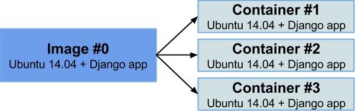
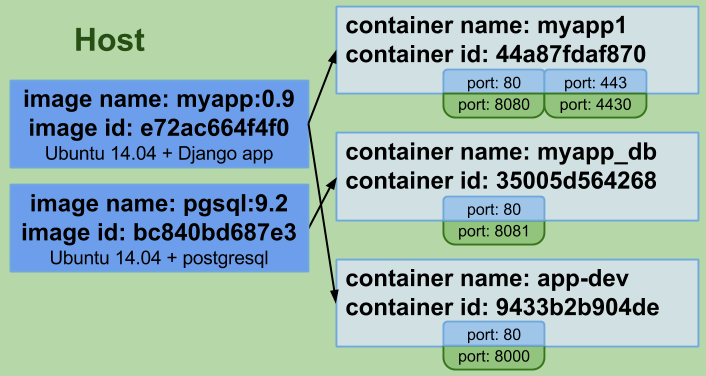
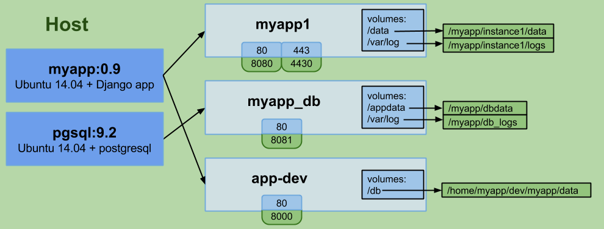
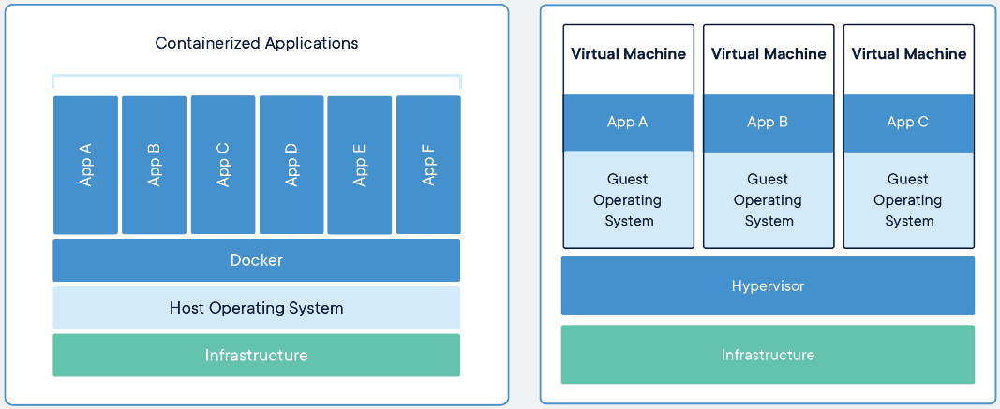
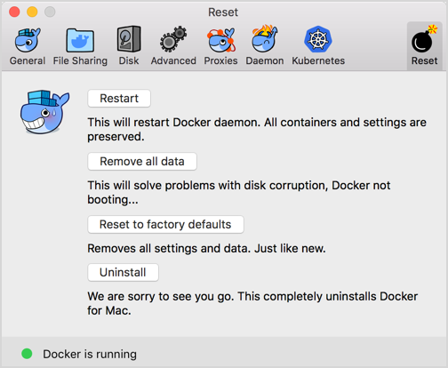
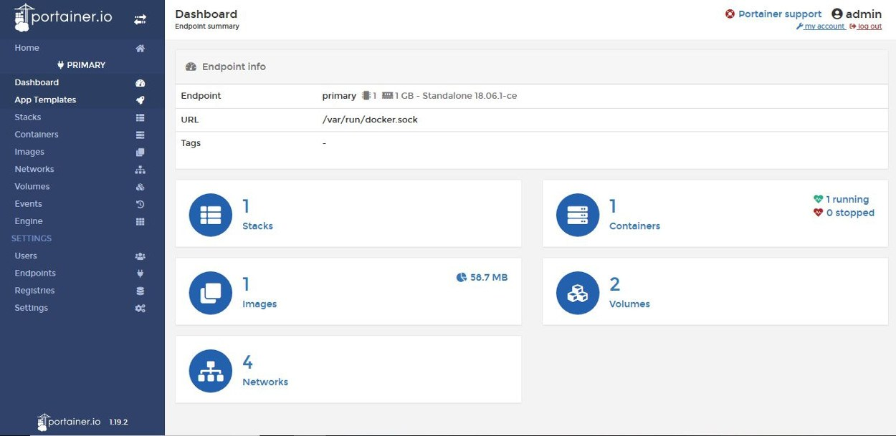
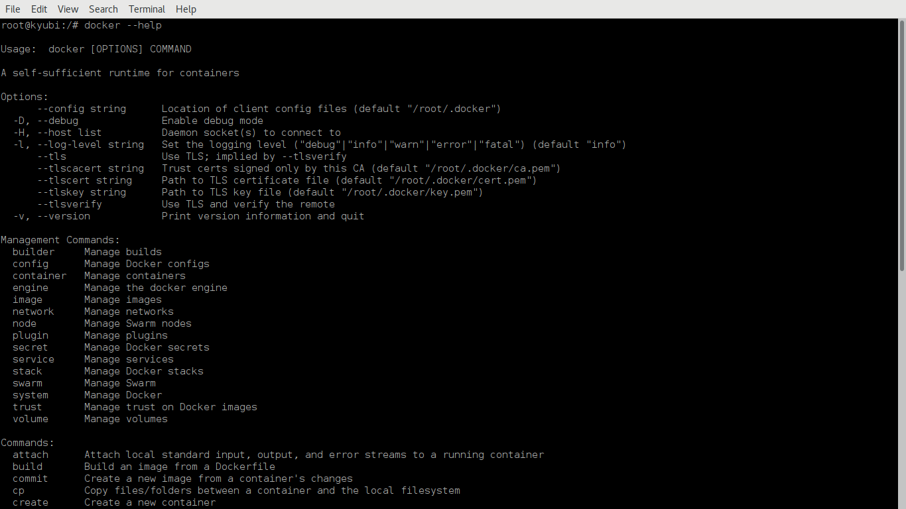

# Introducción a

#### para principiantes

<small>FLISOL 2019 - Isla de la Juventud</small>

---

### ¿Quién soy?

--

Leonel Salazar Videaux

____

- ¿Max el viajero?
- Principiante usando Docker
- Usando software libre exclusivamente desde 2004
- Programando con Python todos los días desde hace 6 años
- Fundador de [DebianHlg](https://debianhlg.cubava.cu)

---

### En esta charla
____

- ¿Qué es Docker?
- ¿Para qué sirve?
- ¿Cómo se usa?
- Ejemplo simple

---

### ¿Qué es Docker?

--
- Fundado por  Solomon Hykes en Marzo del 2013
- Recibe colaboraciones de empresas como RedHat, Microsoft y Google
- Mantenido por [Docker-Inc](https://www.docker.com)
- Versión Enterprise, versión Comunitaria, Repositorio de Imágenes
- Puede ejecutarse en GNU/Linux, macOS y Windows

--

- Permite crear "máquinas virtuales" (imágenes) para ejecutar nuestras aplicaciones
- Permite ejecutar esas imágenes (contenedores) en entornos aislados y protegidos unos de otros
- Los datos pueden ser volátiles o persistentes
- Se puede regular el uso de memoria, microprocesador, red y espacio en disco
- Se puede ejecutar la misma imagen al mismo tiempo para probar varias aplicaciones a la vez
- Pueden "duplicarse" (replicarse) los contenedores en dependencia de la demanda

--

### ¿Qué es una imagen?
____

- Una "versión en miniatura" de un sistema operativo (Debian, Ubuntu, Centos, Android)
- Pueden contener ningún servicio, uno o más, configurados o no
- Sirven como plantillas para ejecutar nuestras aplicaciones según nuestras necesidades
- Existen muchas en el repositorio [Docker Hub](https://hug.docker.com)
- Podemos construir las nuestras si lo deseamos

--

### ¿Qué es un contenedor?
____

- Una versión de una imagen ejecutándose con una configuración determinada
- Es una instancia de una aplicación en ejecución, por razones de seguridad aislada del resto y del anfitrión también 

--

- Los contenedores se pueden comunicar entre si para colaborar y ejecutar correctamente una aplicación o varias aplicaciones

--

- Los contenedores solo tienen acceso a escribir datos en su propio proceso, esos datos son volátiles excepto cuando se usan ***volúmenes*** de datos para su ejecución
- Los volúmenes son carpetas del sistema operativo anfitrión que se comparten con los contenedores para que guarden datos

--

--

### Diferencias entre una máquina virtual y un contenedor

---

### ¿Para qué sirve?

--

Para **desarrolladores**
____

- Permite crear imágenes que cumplan con los requisitos específicos que necesitan las aplicaciones que desarrollan y para enviarlas a producción sin problemas de dependencias
- Permite crear aplicaciones usando diferentes versiones de las herramientas de desarrollo en la misma PC sin temor a que ocurran conflictos
- Permite probar aplicaciones de terceros rápidamente en las mismas condiciones que usaron los creadores originales

--

Para **admistradores de sistemas**
____

- Permite desplegar las mismas aplicaciones usando diferentes configuraciones sin temor a que ocurran conflictos entre ellas
- Garantiza que las aplicaciones se ejecuten usando las mismas condiciones en las que se crearon
- Permite replicar los contenedores para brindar más servicios
- Permite recuperarse rápidamente de los fallos al ejecutar las aplicaciones

---

### ¿Cómo se usa?

--

- La instalación depende del sistema operativo donde queremos ejecutar Docker
- Instrucciones para [Debian GNU/Linux](https://docs.docker.com/install/linux/docker-ce/debian/)
- ¿Cómo lo puedo usar?

--

### Docker Desktop

--

### Portainer

--

### Comandos por consola

--

Comandos básicos
____

- docker images
- docker pull
- docker run
- docker start
- docker stop
- docker ps
- docker rm
- docker rmi

---

### Ejemplo simple

--

Ejecutar varias instancias de Nginx mostrando diferentes páginas de bienvenida

---
Quizás tengan algunas preguntas, pero la más importante es: 

¿tendré yo las respuestas?

---

Muchas gracias

